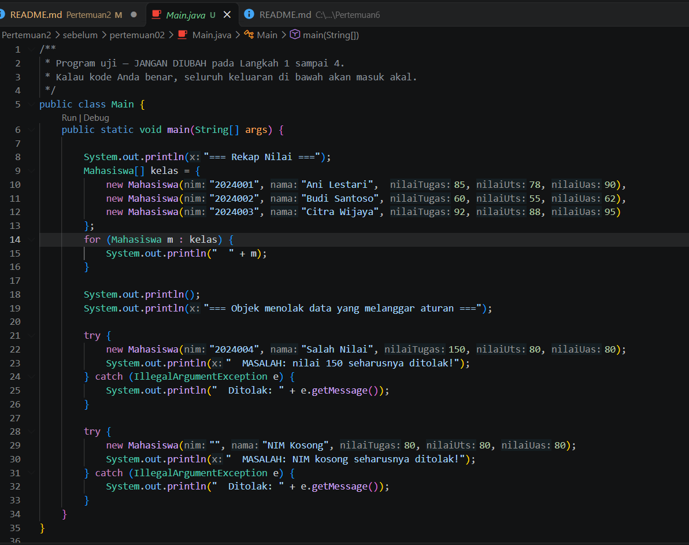
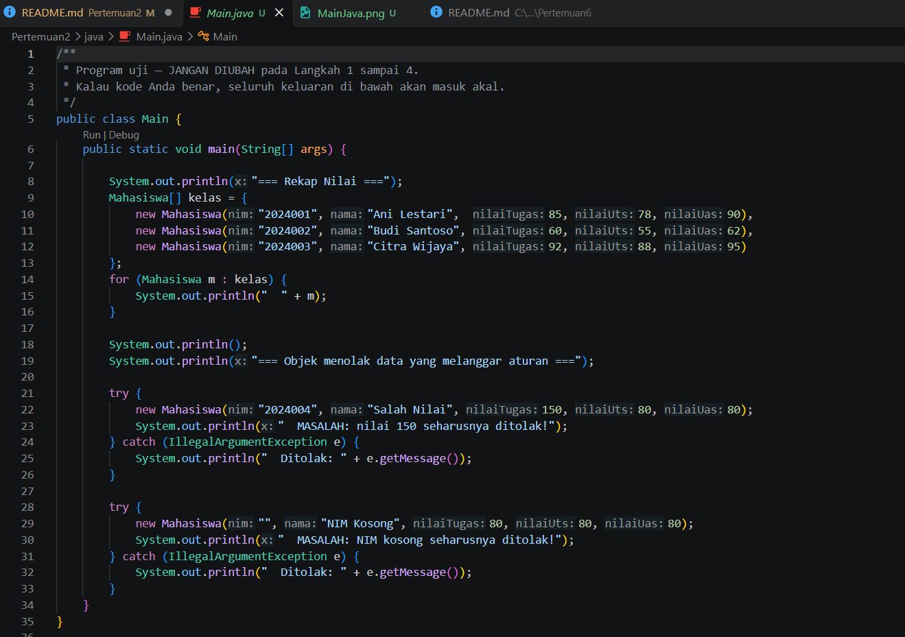
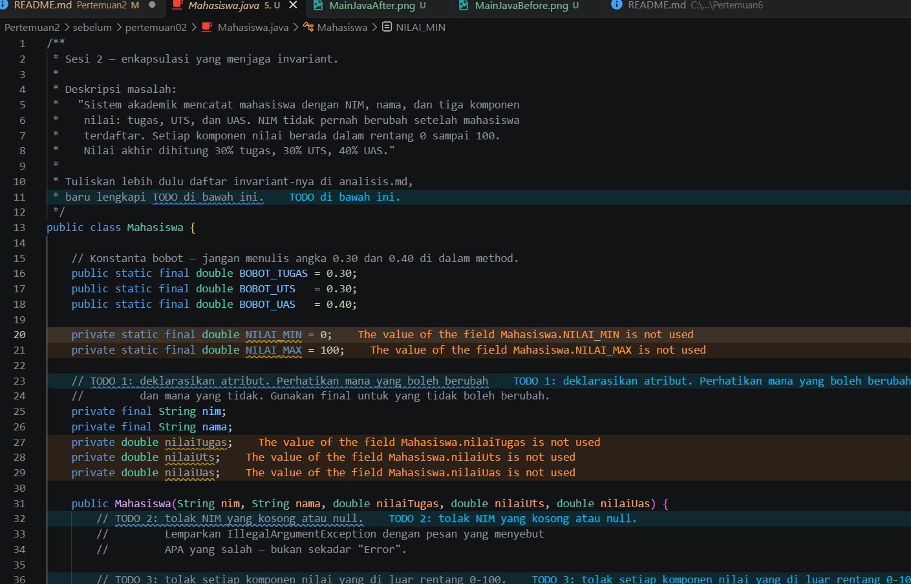
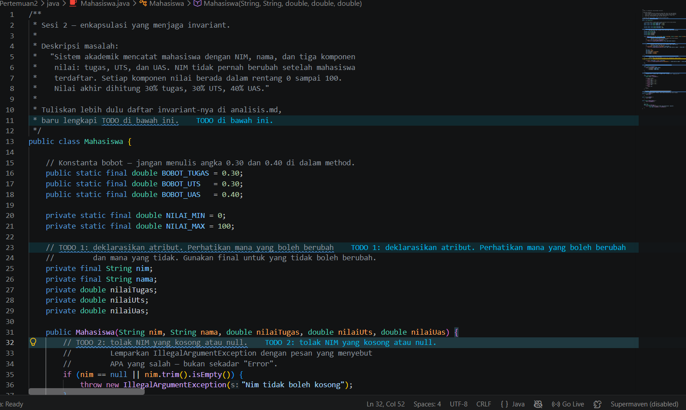
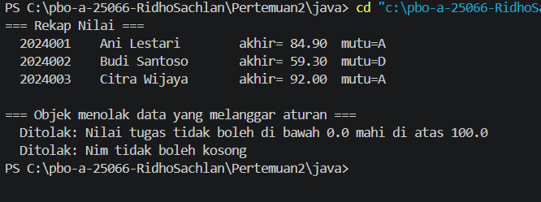
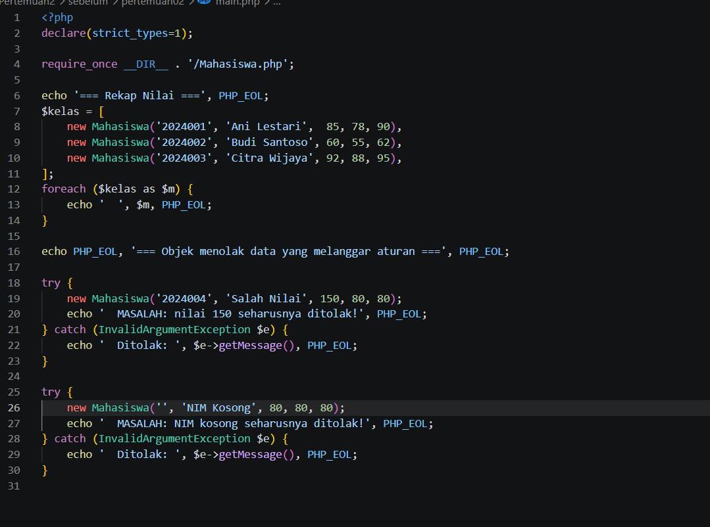
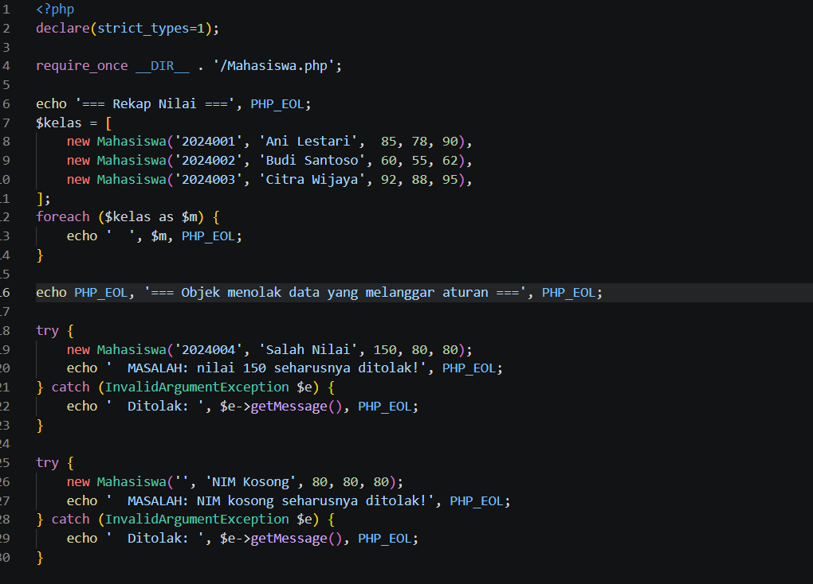
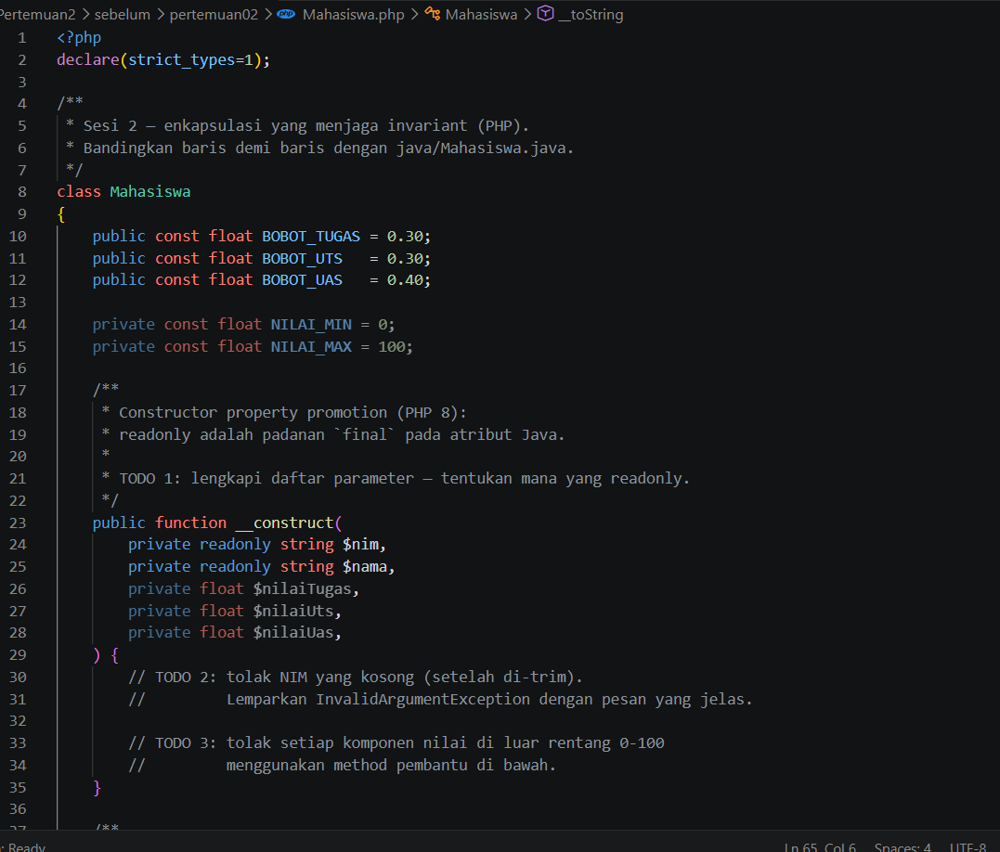
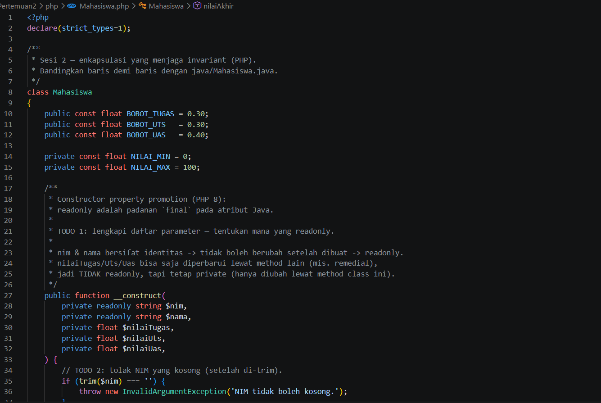
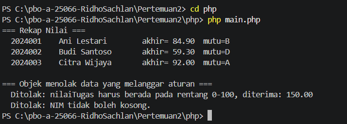

# LAPORAN PRAKTIKUM PEMROGRAMAN BERBASIS OBJEK

| Informasi Praktikan | Keterangan |
| :--- | :--- |
| **Nama** | Ridho Sachlan |
| **NPM** | 4525210066 |
| **Kelas** | A |
| **Mata Kuliah** | Pemrograman Berbasis Objek (PBO) |
| **Pertemuan** | 02 - Kelas, Objek, dan Enkapsulasi |
| **Tanggal** | Kamis, 10 September 2026 |

## 1. Implementasi Java

### 1.1. File: `Main.java`

**Penjelasan Kode:**
> Kelas utama untuk menjalankan program, menguji pembuatan objek Mahasiswa, menampilkan rekap nilai, serta menangani error (exception) saat ada data input yang melanggar aturan.

**Bukti Eksekusi (Screenshot):**
- **Before** : 
- **After**  : 

### 1.2. File: `Mahasiswa.java`

**Penjelasan Kode:**
> Atribut identitas seperti NIM dan Nama dibuat tetap (final), sementara komponen nilai divalidasi pada rentang 0–100 sebelum dihitung nilai akhirnya berdasarkan bobot.

**Bukti Eksekusi (Screenshot):**
- **Before** :  
- **After**  :  

### Output

 

---

## 2. Implementasi PHP

### 2.1. File: `main.php`

**Penjelasan Kode:**
> Program utama PHP yang memuat kelas Mahasiswa, membuat objek data, menampilkan rekapitulasi, dan menangkap exception untuk input data yang tidak valid.

**Bukti Eksekusi (Screenshot):**
- **Before** :  
- **After**  :  

### 2.2. File: `Mahasiswa.php`

**Penjelasan Kode:**
> Implementasi kelas Mahasiswa dalam PHP menggunakan Constructor Property Promotion, atribut readonly untuk identitas, serta fungsi match untuk menentukan huruf mutu secara ringkas.

**Bukti Eksekusi (Screenshot):**
- **Before** :  
- **After**  : 

### Output

---

## 3. Kesimpulan

Enkapsulasi berfungsi melindungi data internal kelas agar tetap konsisten dan sesuai aturan bisnis. Validasi pada konstruktor memastikan setiap objek yang terbentuk selalu berada dalam kondisi yang sah dan valid.
