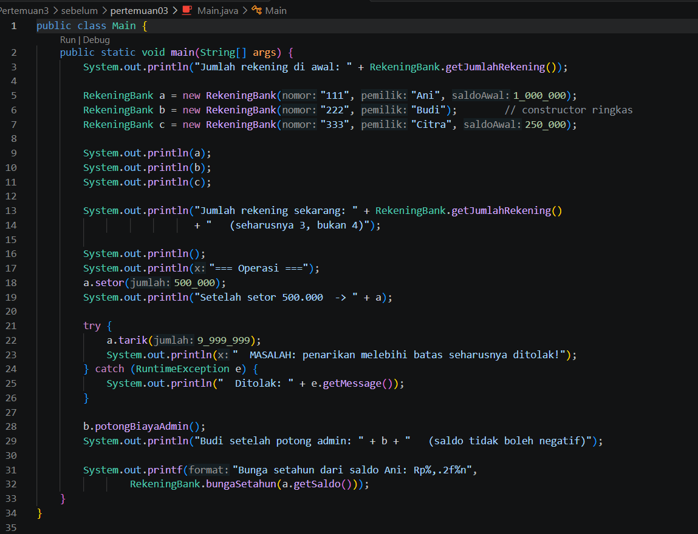
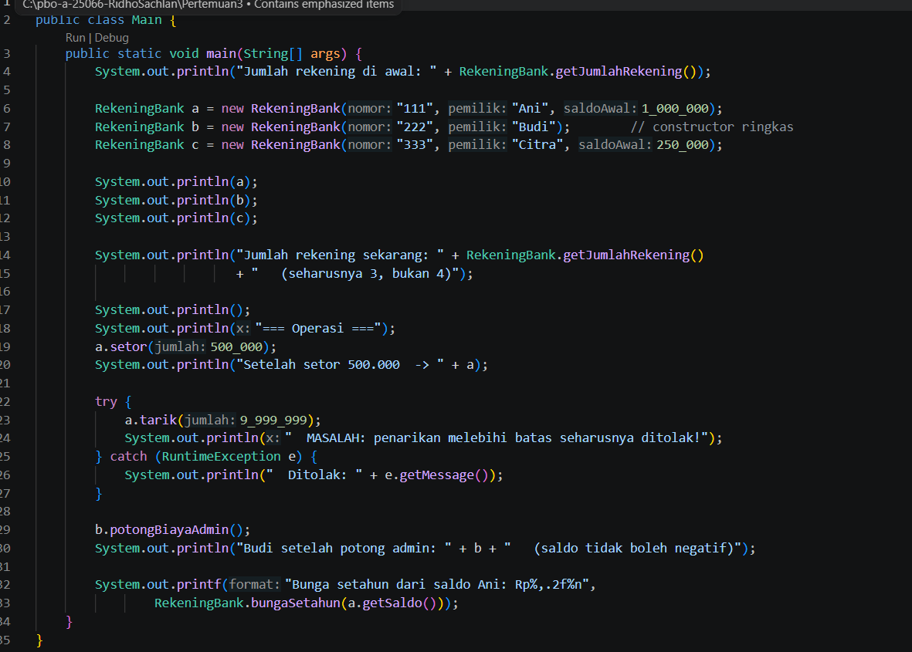
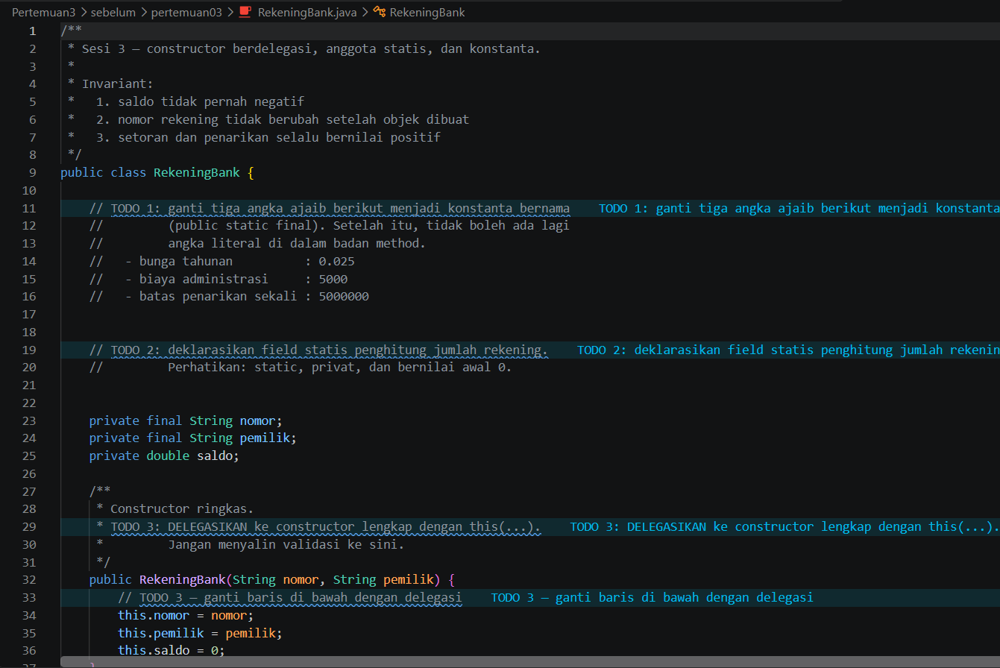
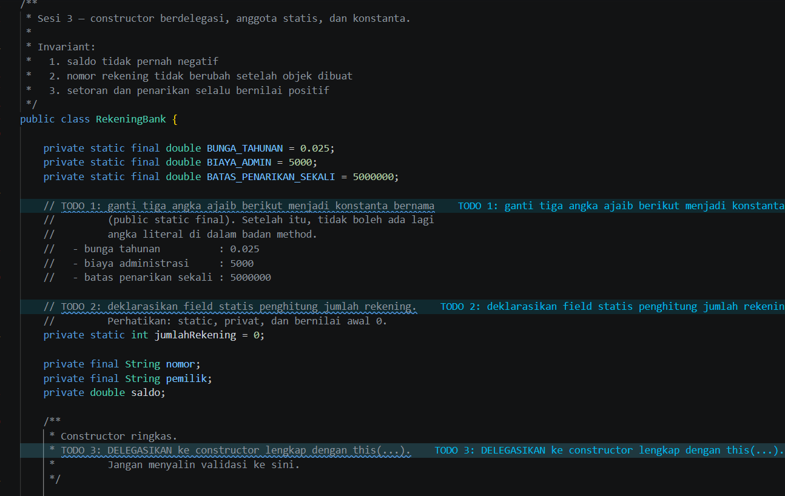
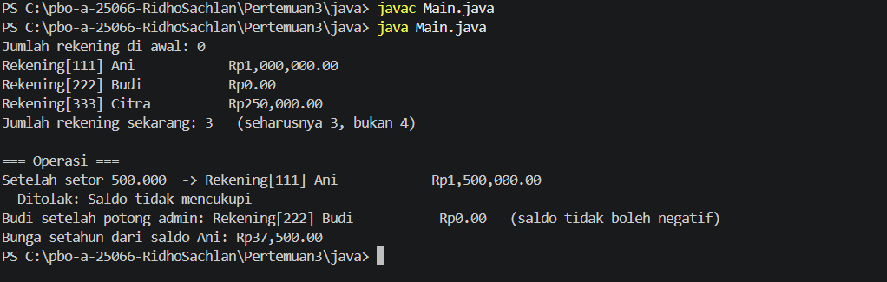
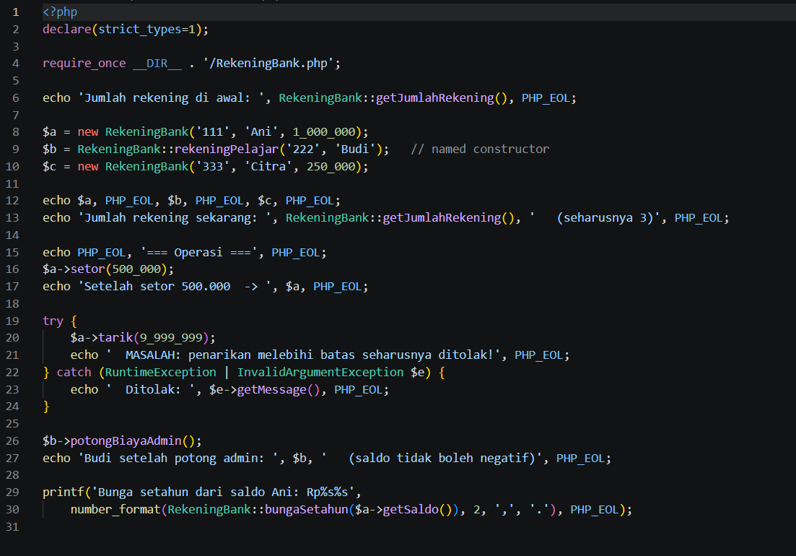
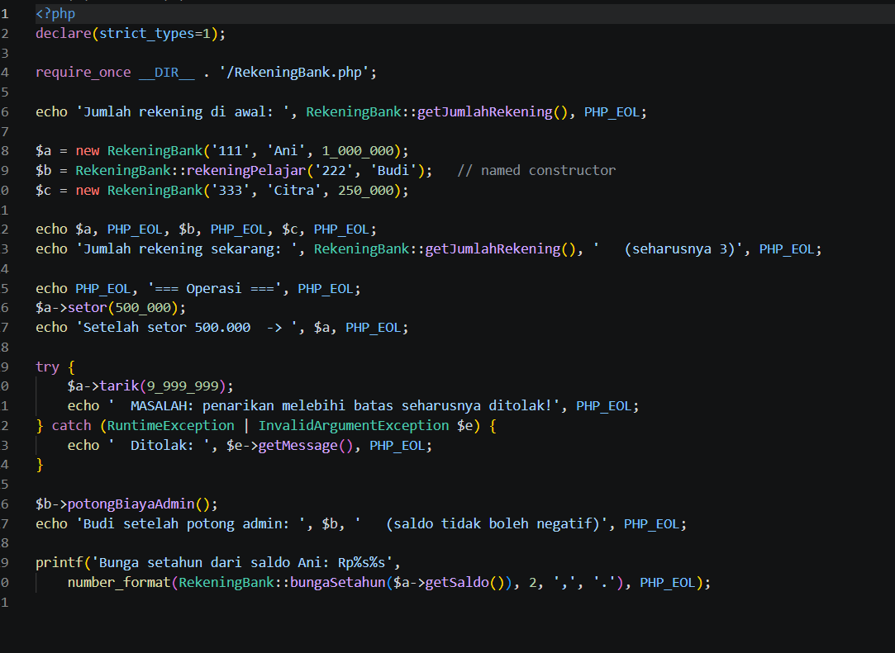
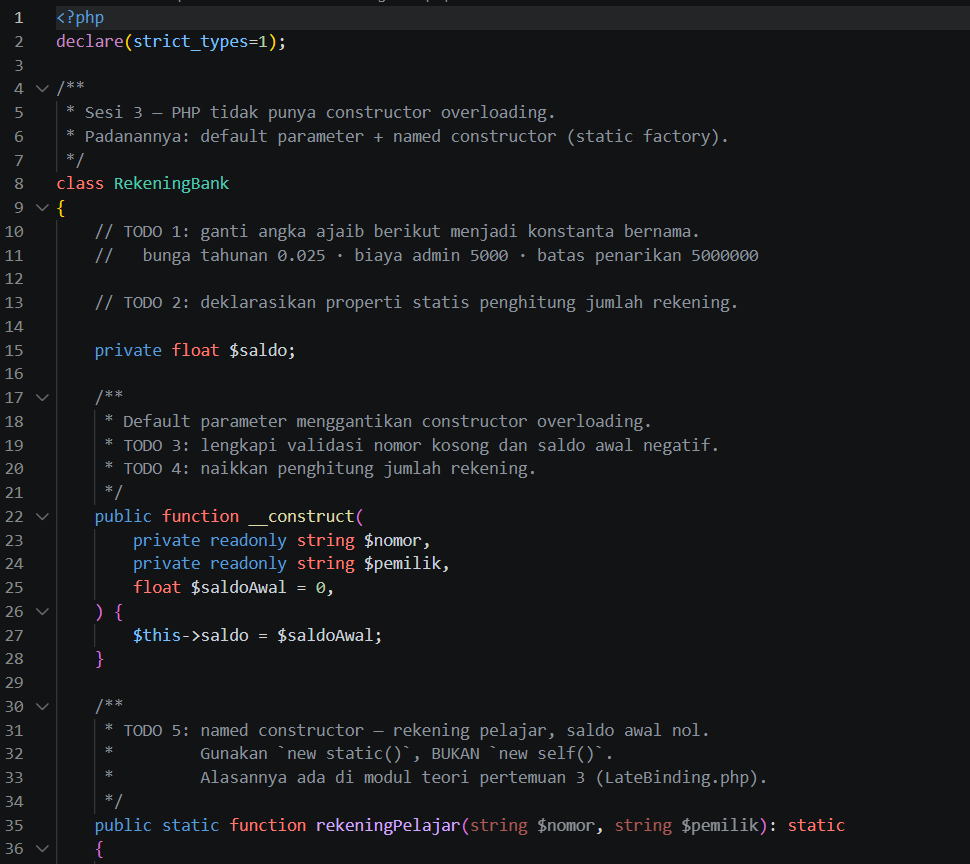
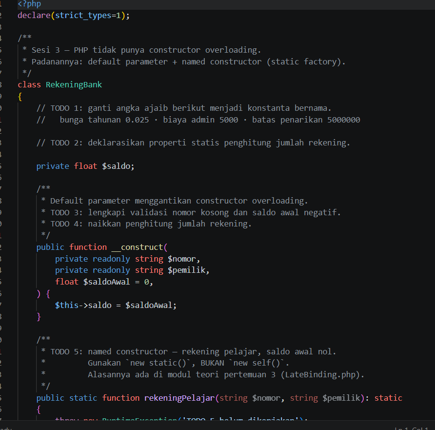
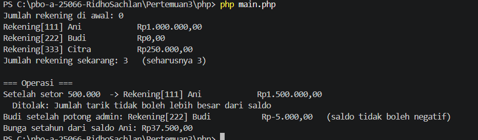

# LAPORAN PRAKTIKUM PEMROGRAMAN BERBASIS OBJEK

| Informasi Praktikan | Keterangan |
| :--- | :--- |
| **Nama** | Ridho Sachlan |
| **NPM** | 4525210066 |
| **Kelas** | A |
| **Mata Kuliah** | Pemrograman Berbasis Objek (PBO) |
| **Pertemuan** | 03 - Constructor, Anggota Statis, dan Konstanta |
| **Tanggal** | Kamis, 17 September 2026 |

## 1. Implementasi Java

### 1.1. File: `Main.java`

**Penjelasan Kode:**
> Kelas utama untuk menjalankan program, menguji instansiasi objek rekening, serta melakukan simulasi transaksi setoran dan penarikan saldo.

**Bukti Eksekusi (Screenshot):**
- **Before** : 
- **After**  : 

### 1.2. File: `RekeningBank.java`

**Penjelasan Kode:**
> Merepresentasikan rekening bank. mengatur nomor rekening, nama pemilik, saldo, serta validasi aturan bisnis seperti pencegahan penarikan melebihi saldo atau saldo minimum.

**Bukti Eksekusi (Screenshot):**
- **Before** : 
- **After**  : 

### Output

---

## 2. Implementasi PHP

### 2.1. File: `main.php`

**Penjelasan Kode:**
> Menjalankan skenario rekening bank di PHP, membuat objek rekening bank, dan menguji fungsi-fungsi transaksi finansial.
**Bukti Eksekusi (Screenshot):**
- **Before** : 
- **After**  : 

### 2.2. File: `RekeningBank.php`

**Penjelasan Kode:**
> Implementasi rekening bank PHP dengan konstruktor, anggota static, konstanta, validasi saldo dan transaksi, serta method untuk setor, tarik, biaya administrasi, dan bunga.

**Bukti Eksekusi (Screenshot):**
- **Before** :  
- **After**  :  

### Output

---

## 3. Kesimpulan

Relasi antar-objek mempermudah pengelolaan data yang kompleks secara modular. Validasi di dalam kelas entitas menjaga integritas data keuangan agar terhindar dari kondisi saldo ilegal.
