# LAPORAN PRAKTIKUM PEMROGRAMAN BERBASIS OBJEK

| Informasi Praktikan | Keterangan |
| :--- | :--- |
| **Nama** | Ridho Sachlan |
| **NPM** | 4525210066 |
| **Kelas** | A |
| **Mata Kuliah** | Pemrograman Berbasis Objek (PBO) |
| **Pertemuan** | 04 - Inheritance (Pewarisan) |
| **Tanggal** | Kamis 24 September 2026 |

## 1. Implementasi Java

### 1.1. File: `Main.java`

**Penjelasan Kode:**
> Kelas utama untuk menguji instansiasi objek pegawai tetap dan pegawai kontrak serta memanggil method perhitungan gaji masing-masing.

**Bukti Eksekusi (Screenshot):**
- **Before** : 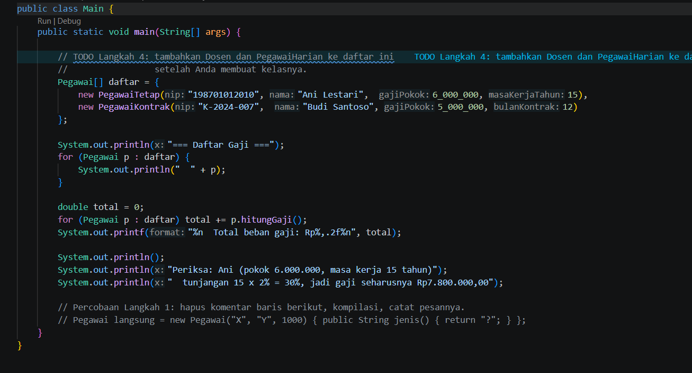
- **After**  : 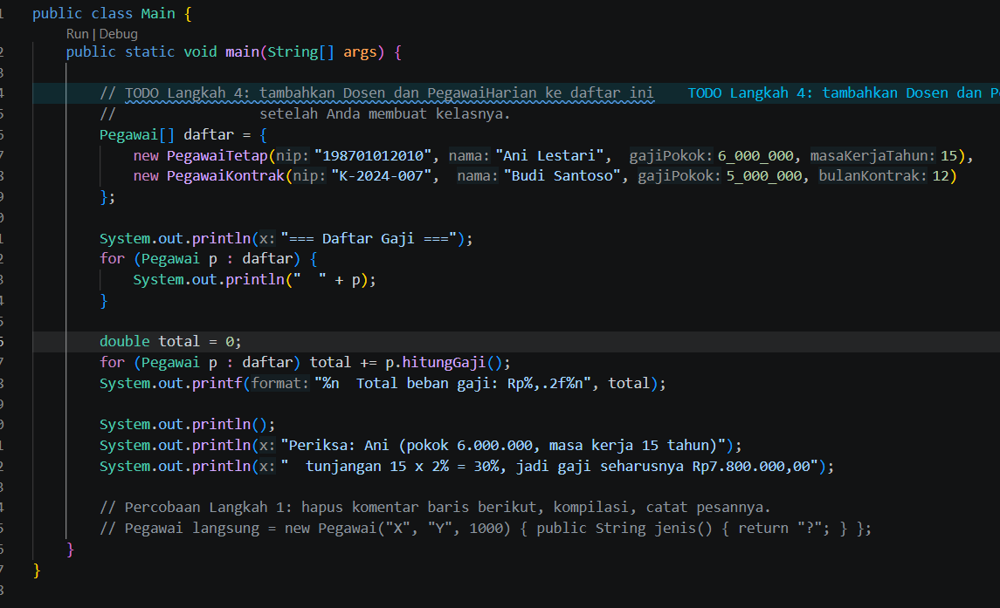
### 1.2. File: `Pegawai.java`

**Penjelasan Kode:**
> Kelas induk yang mendefinisikan atribut umum seperti nama, NIP, dan gaji pokok bagi seluruh jenis pegawai.

**Bukti Eksekusi (Screenshot):**
- **Before** : 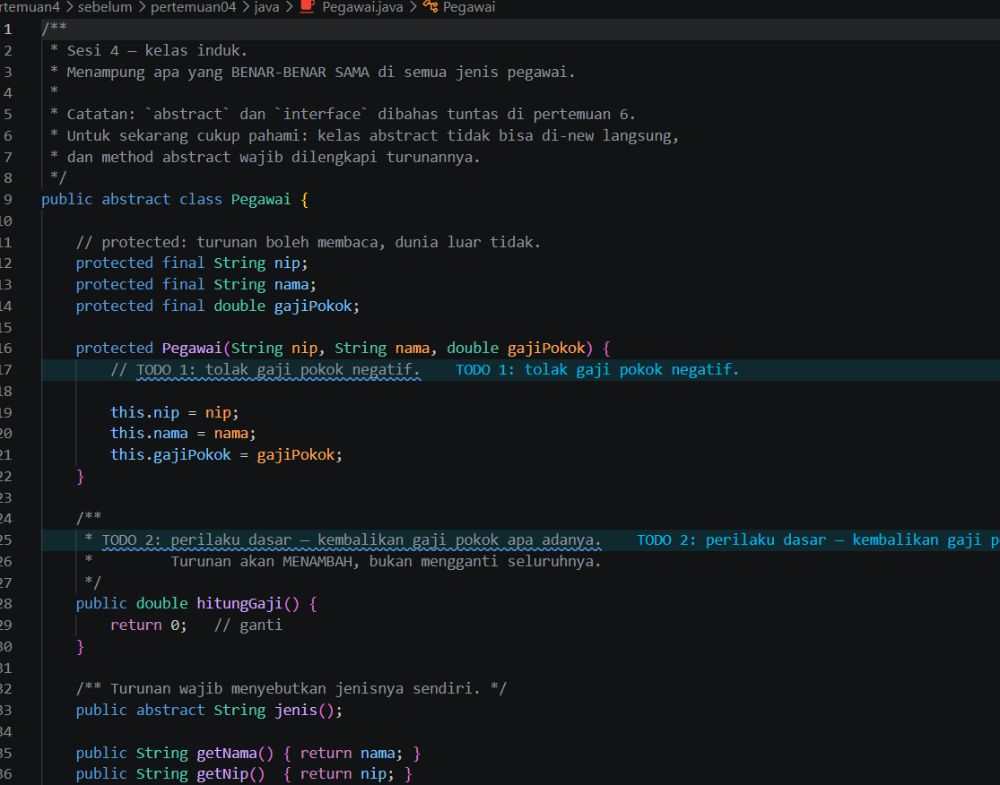
- **After**  : 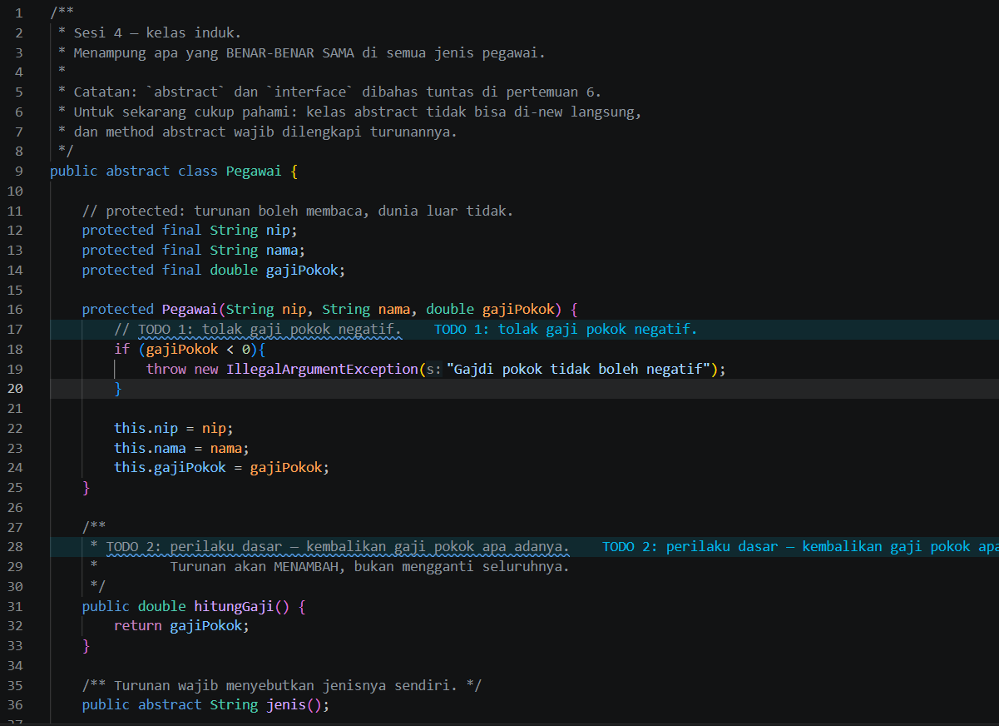

### 1.3. File: `PegawaiKontrak.java`

**Penjelasan Kode:**
> Kelas turunan (subclass) yang mewarisi sifat induk dan mengimplementasikan perhitungan gaji spesifik melalui method overriding.

**Bukti Eksekusi (Screenshot):**
- **Before** : 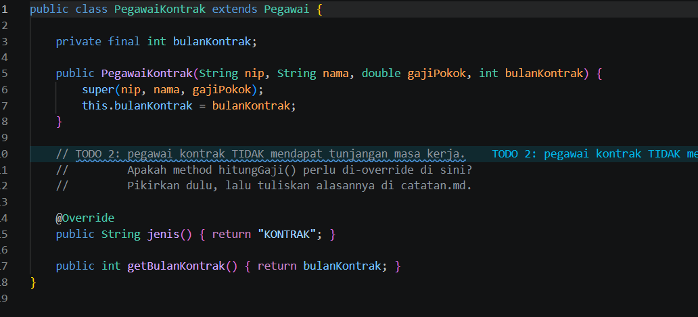
- **After**  : 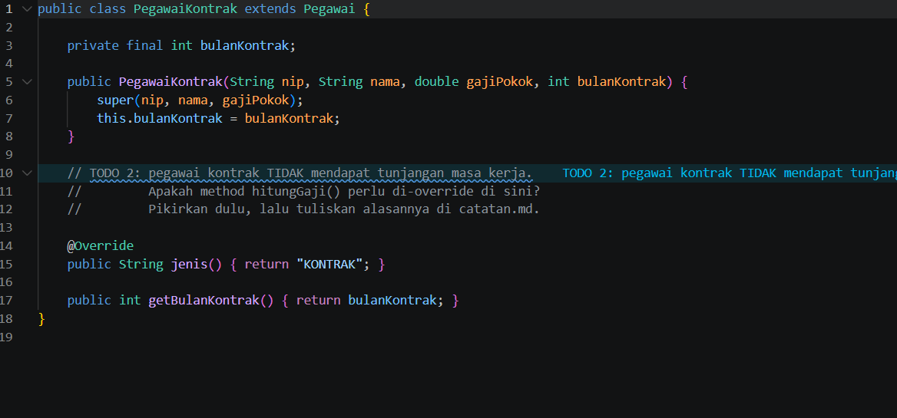

### 1.4. File: `PegawaiTetap.java`

**Penjelasan Kode:**
> Kelas turunan (subclass) yang mewarisi sifat induk dan mengimplementasikan perhitungan gaji spesifik melalui method overriding.

**Bukti Eksekusi (Screenshot):**
- **Before**: 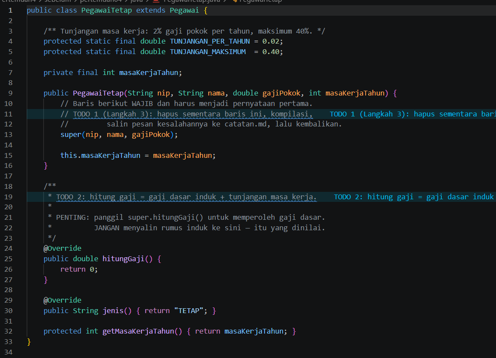
- **After** : 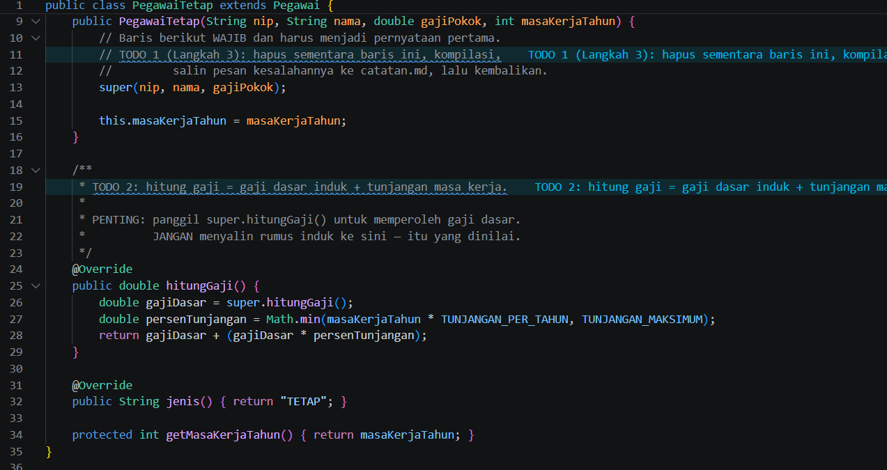

### Output

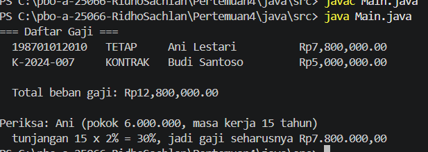

---

## 2. Implementasi PHP

### 2.1. File: `main.php`

**Penjelasan Kode:**
> Program PHP yang mengeksekusi objek kepegawaian dan menampilkan rincian pendapatan akhir.

**Bukti Eksekusi (Screenshot):**
- **Before** : 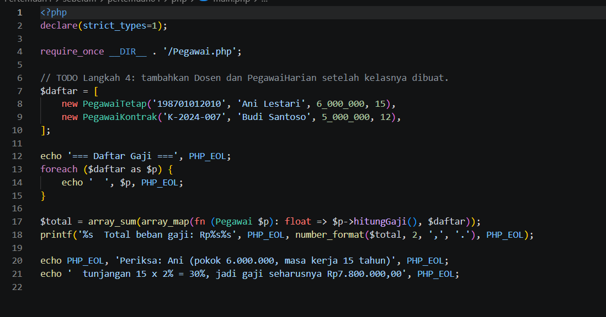
- **After**  : 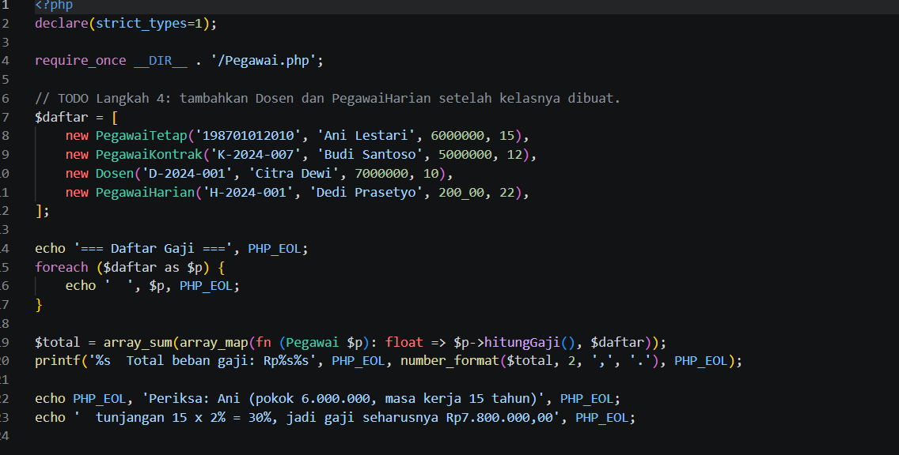

### 2.2. File: `Pegawai.php`

**Penjelasan Kode:**
> Implementasi struktur hierarki kelas kepegawaian dalam PHP menggunakan mekanisme pewarisan kelas dan modifikasi perilaku method.

**Bukti Eksekusi (Screenshot):**
- **Before** : 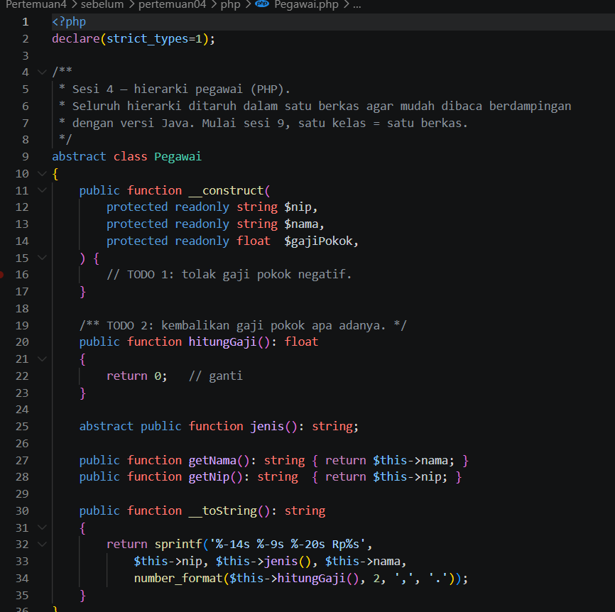
- **After**  : 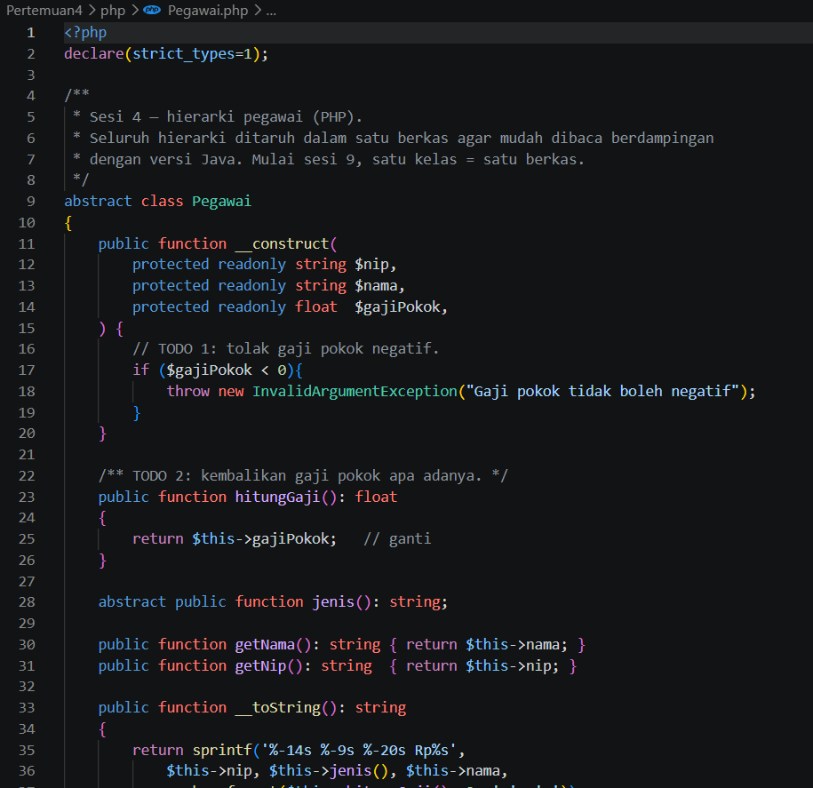

### Output

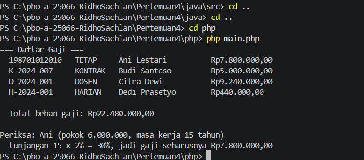

---

## 3. Kesimpulan

Pewarisan meningkatkan efisiensi penulisan kode melalui penggunaan ulang (code reuse), sementara method overriding memungkinkan fleksibilitas penentuan perilaku spesifik pada subclass.
