# LAPORAN PRAKTIKUM PEMROGRAMAN BERBASIS OBJEK

| Informasi Praktikan | Keterangan |
| :--- | :--- |
| **Nama** | Ridho Sachlan |
| **NPM** | 4525210066 |
| **Kelas** | A |
| **Mata Kuliah** | Pemrograman Berbasis Objek (PBO) |
| **Pertemuan** | 05 - Polimorfisme |
| **Tanggal** | Kamis, 1 Oktober 2026 |

---

## 1. Implementasi Java

### 1.1. File: `Main.java`

**Penjelasan Kode:**
> Menguji pemanggilan polimorfik pada berbagai objek turunan kelas abstrak.

**Bukti Eksekusi (Screenshot):**
- **Before** : 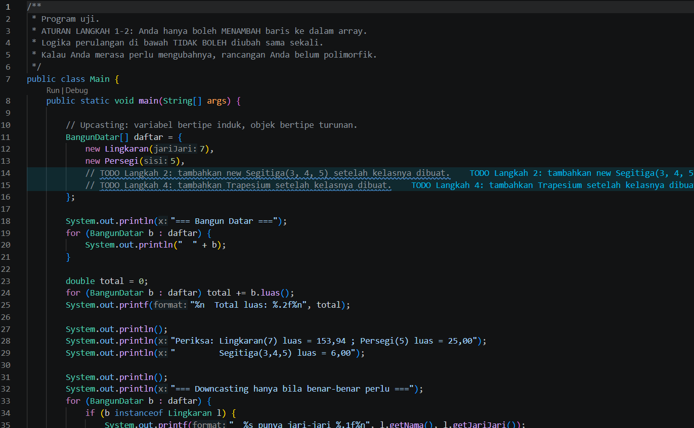
- **After** : 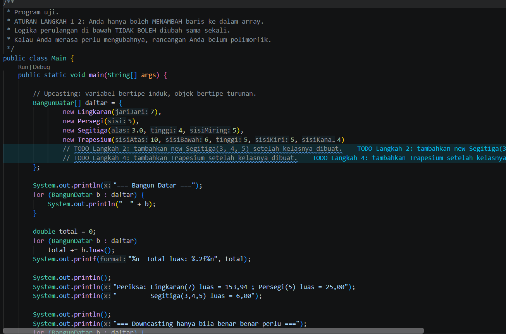

### 1.2. File: `AntiPattern.java`

**Penjelasan Kode:**
> Pola yang membutuhkan pemeriksaan tipe atau percabangan untuk setiap bentuk.

**Bukti Eksekusi (Screenshot):**
- **Tidak ada perubahan pada file tersebut** 
### 1.3. File: `BangunDatar.java`

**Penjelasan Kode:**
> Kelas abstrak yang mendefinisikan kerangka method wajib seperti hitung luas dan keliling untuk diturunkan ke kelas bentuk geometris.

**Bukti Eksekusi (Screenshot):**
- **Tidak ada perubahan pada file tersebut** 
### 1.4. File: `Lingkaran.java`

**Penjelasan Kode:**
> Kelas bangun datar berbentuk lingkaran yang menghitung luas berdasarkan jari-jari.

**Bukti Eksekusi (Screenshot):**
- **Before** (kondisi awal/kesalahan, jika ada): 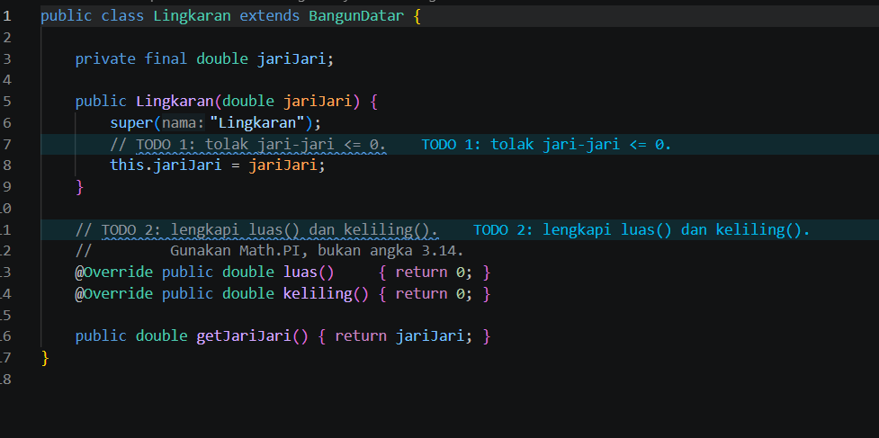
- **After** (kondisi akhir): 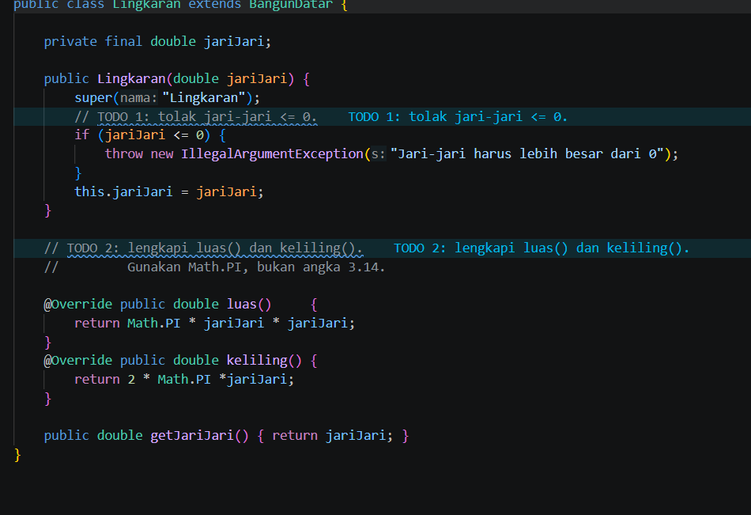

### 1.5. File: `Persegi.java`

**Penjelasan Kode:**
> Kelas bangun datar berbentuk persegi yang menghitung luas berdasarkan panjang sisi.

**Bukti Eksekusi (Screenshot):**
- **Before** (kondisi awal/kesalahan, jika ada): 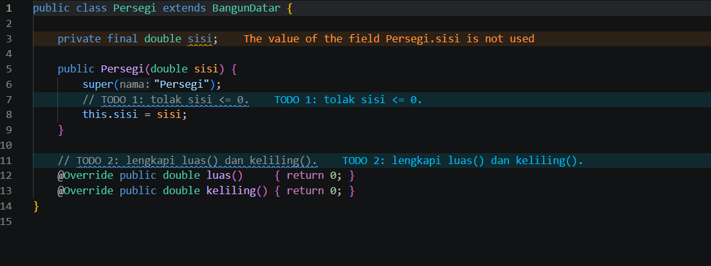
- **After** (kondisi akhir): 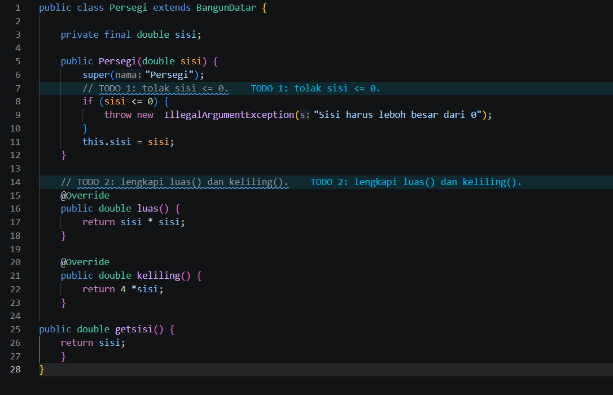

### Output

---

## 2. Implementasi PHP

### 2.1. File: `main.php`

**Penjelasan Kode:**
> Program PHP yang menguji implementasi kelas abstrak dan hasil eksekusi polimorfisme.

**Bukti Eksekusi (Screenshot):**
- **Before** (kondisi awal/kesalahan, jika ada): 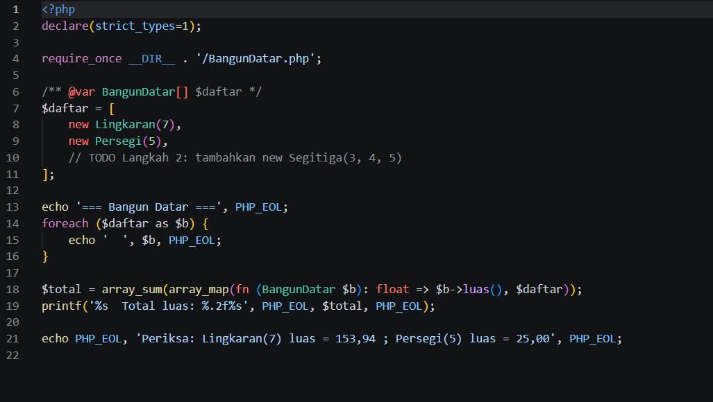
- **After** (kondisi akhir): 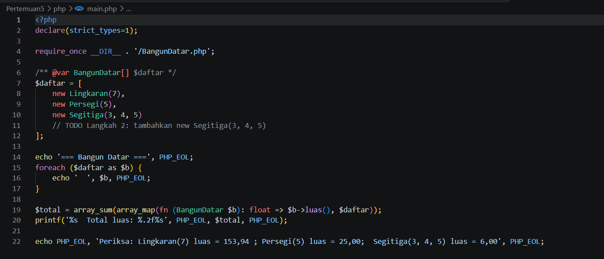

### 2.2. File: `BangunDatar.php`

**Penjelasan Kode:**
> Pendefinisian struktur abstrak dan kelas turunan dalam PHP untuk menjaga keseragaman implementasi antar-komponen.

**Bukti Eksekusi (Screenshot):**
- **Before** (kondisi awal/kesalahan, jika ada): 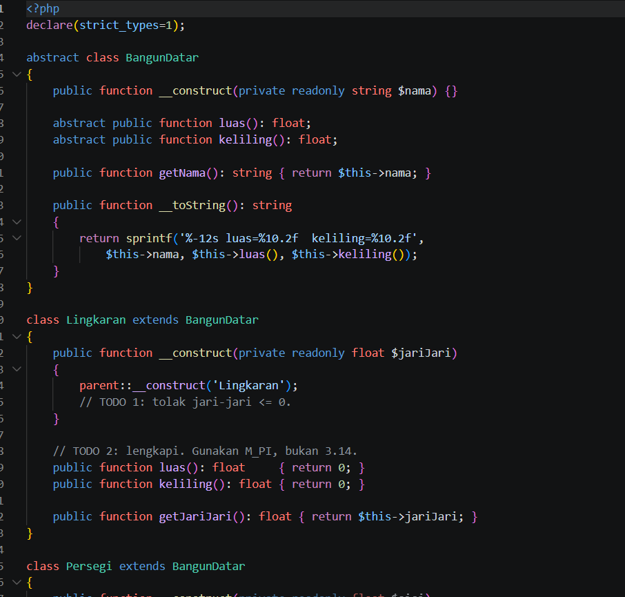
- **After** (kondisi akhir): 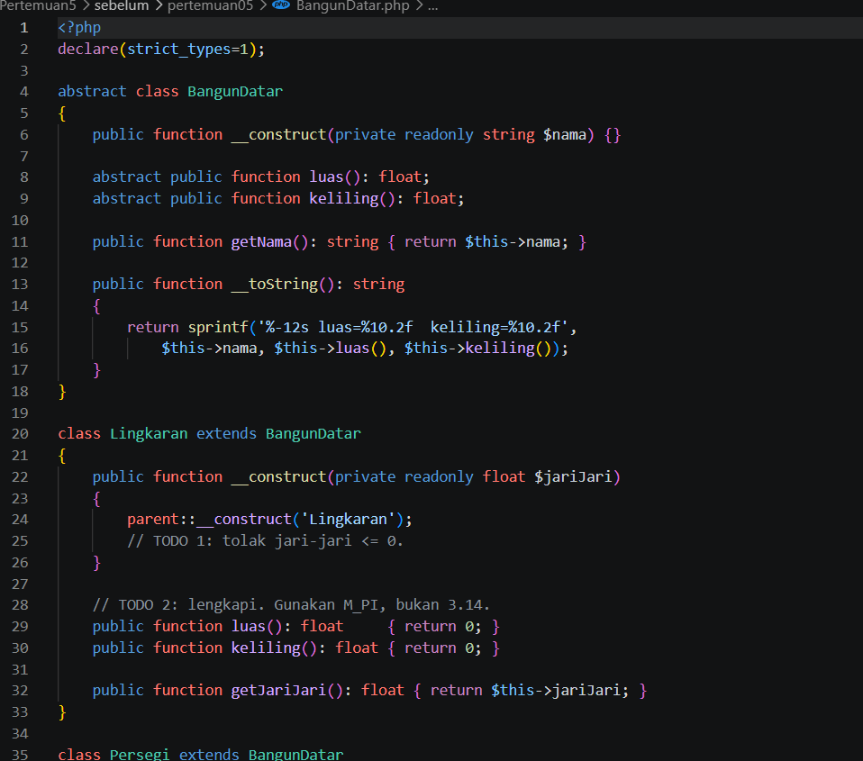

### 2.3. File: `notifikasi.php`

**Penjelasan Kode:**
> Pmanfaatan perilaku polimorfik pada notifikasi, sehingga pemanggil menggunakan antarmuka umum tanpa bergantung pada detail implementasi.

**Bukti Eksekusi (Screenshot):**
- **Before** (kondisi awal/kesalahan, jika ada): 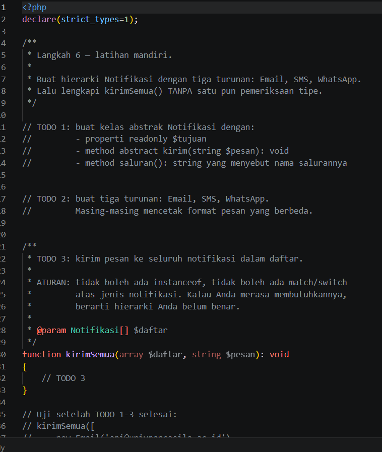
- **After** (kondisi akhir): 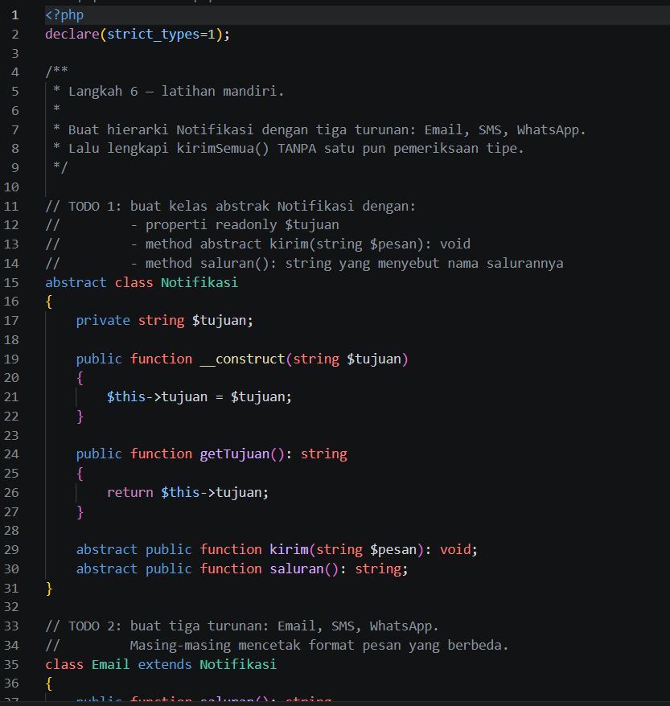

### Output

---

## 3. Kesimpulan

Kelas abstrak memastikan keseragaman struktur desain antar-subsistem, sedangkan polimorfisme memberikan fleksibilitas tinggi dalam pemanggilan fungsi tanpa terikat pada tipe data konkret secara kaku.
