# LAPORAN PRAKTIKUM PEMROGRAMAN BERBASIS OBJEK

| Informasi Praktikan | Keterangan |
| :--- | :--- |
| **Nama** | Ridho Sachlan |
| **NPM** | 4525210066 |
| **Kelas** | A |
| **Mata Kuliah** | Pemrograman Berbasis Objek (PBO) |
| **Pertemuan** | 06 - Abstract Class, Interface, dan Enum |
| **Tanggal** | Kamis, 8 Oktober 2026 |

---

## 1. Implementasi Java

### 1.1. File: `Main.java`

**Penjelasan Kode:**
> Program uji Kelas utama untuk menguji objek kendaraan yang menerapkan berbagai interface perilaku secara bersamaan.

**Bukti Eksekusi (Screenshot):**
- **Before** (kondisi awal/kesalahan, jika ada): 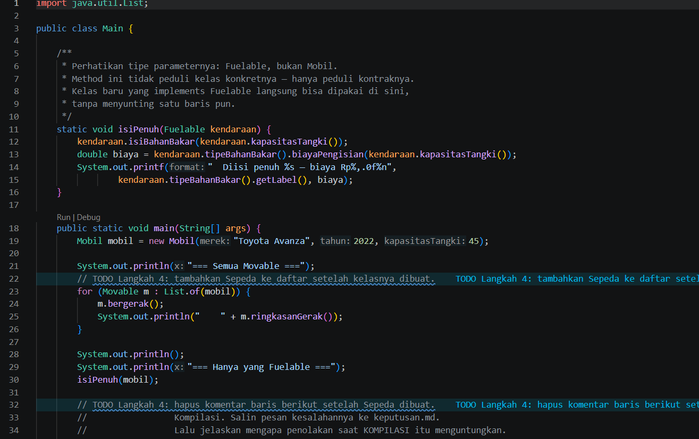
- **After** (kondisi akhir): 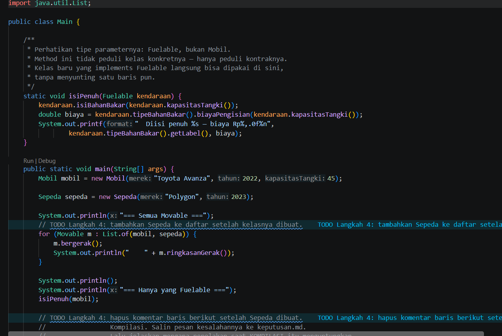

### 1.2. File: `Kendaraan.java`

**Penjelasan Kode:**
> Kelas abstrak yang menyimpan data umum kendaraan, menyediakan perilaku bersama, dan mewajibkan kelas turunan mendefinisikan jumlah roda.

**Bukti Eksekusi (Screenshot):**
- **Before** (kondisi awal/kesalahan, jika ada): 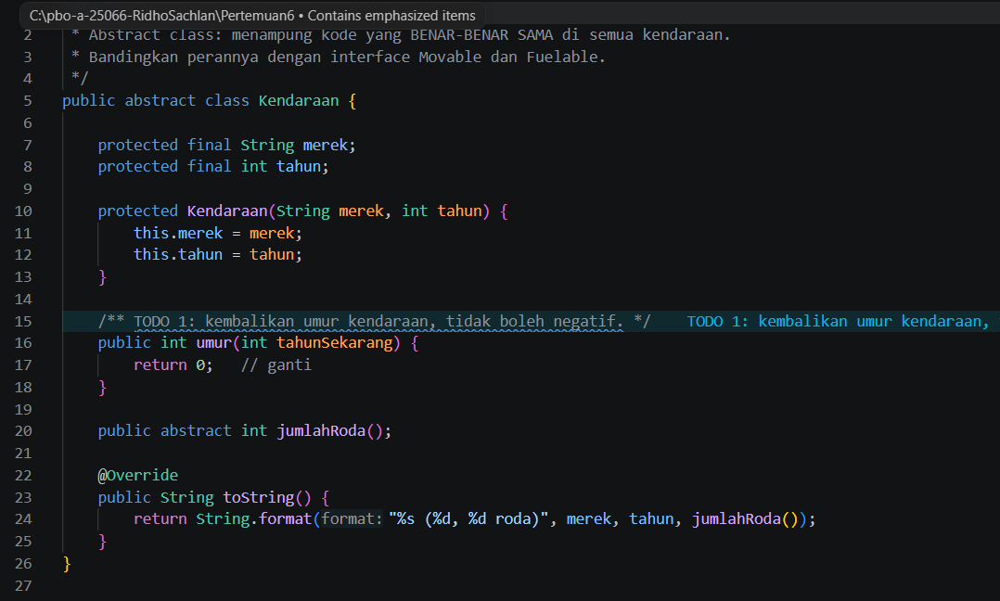
- **After** (kondisi akhir): 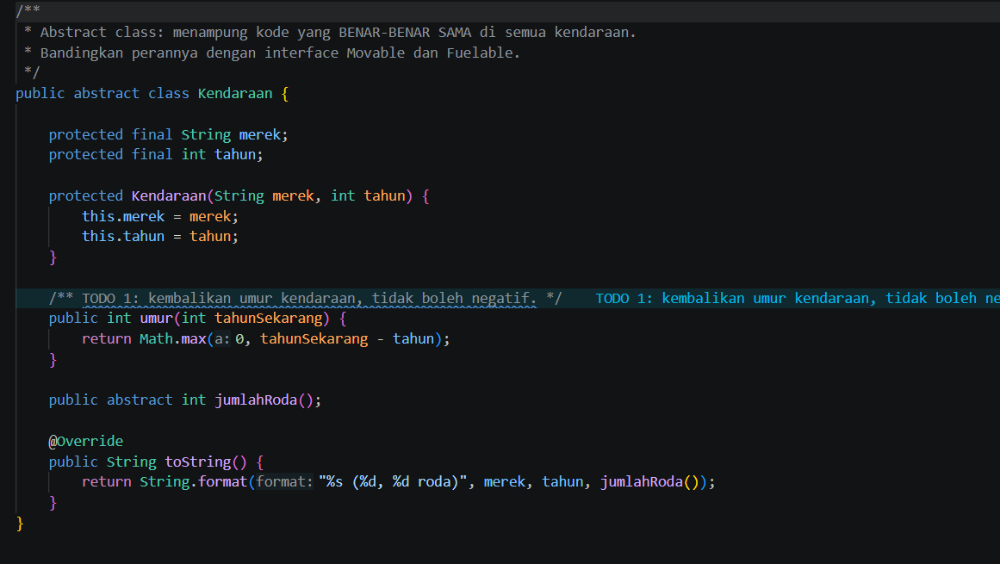

### 1.3. File: `Mobil.java`

**Penjelasan Kode:**
> Kelas turunan Kendaraan yang mengimplementasikan lebih dari satu interface sekaligus untuk merepresentasikan perilaku objek secara nyata.

**Bukti Eksekusi (Screenshot):**
- **Before** (kondisi awal/kesalahan, jika ada): 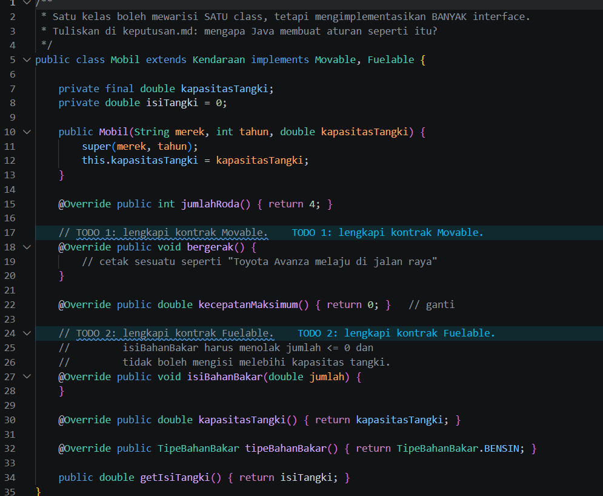
- **After** (kondisi akhir): 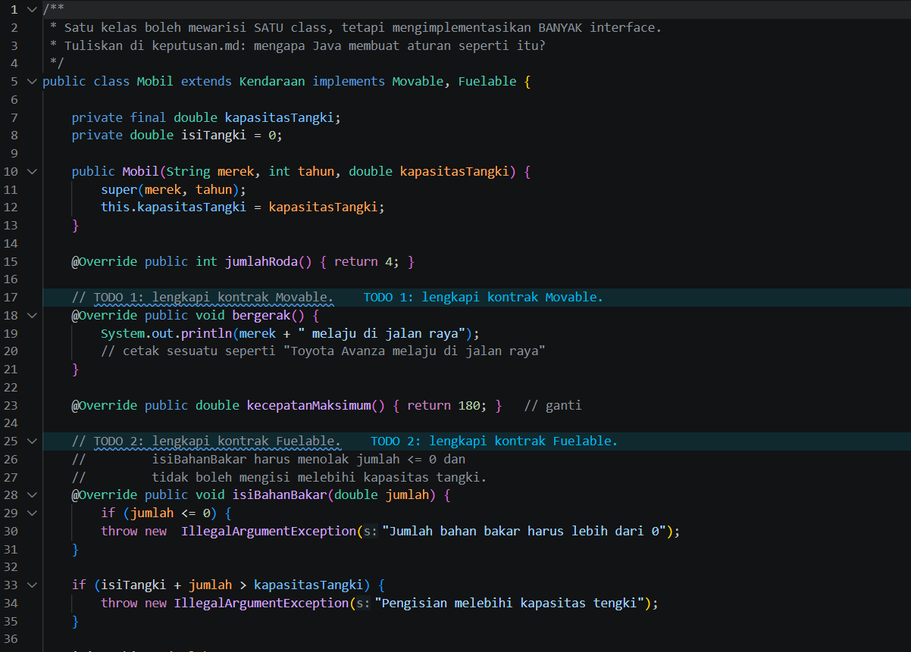

### 1.4. File: `Sepeda.java`

**Penjelasan Kode:**
> Kelas turunan Kendaraan yang mengimplementasikan Movable. Sepeda dapat bergerak, tetapi tidak memenuhi kontrak Fuelable.

**Bukti Eksekusi (Screenshot):**
- **File sepeda baru dibuat saat praktikum**
- **src code**: 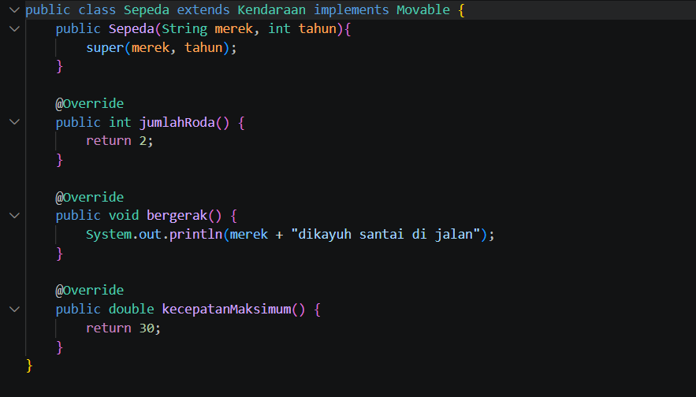

### 1.5. File: `Movable.java`

**Penjelasan Kode:**
> Antarmuka (interface) yang mendefinisikan aksi standar seperti kemampuan bergerak atau pengisian bahan bakar tanpa logika internal.

**Bukti Eksekusi (Screenshot):**
- **Before** (kondisi awal/kesalahan, jika ada): 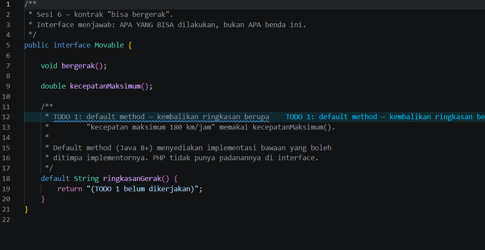
- **After** (kondisi akhir): 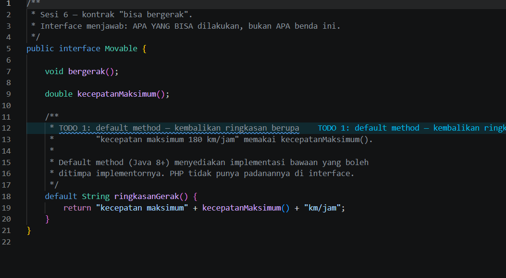

### 1.6. File: `TipeBahanBakar.java`

**Penjelasan Kode:**
> Enum berisi pilihan bahan bakar yang valid beserta label, harga per satuan, perhitungan biaya pengisian, dan informasi ramah lingkungan.

**Bukti Eksekusi (Screenshot):**
- **Before** (kondisi awal/kesalahan, jika ada): 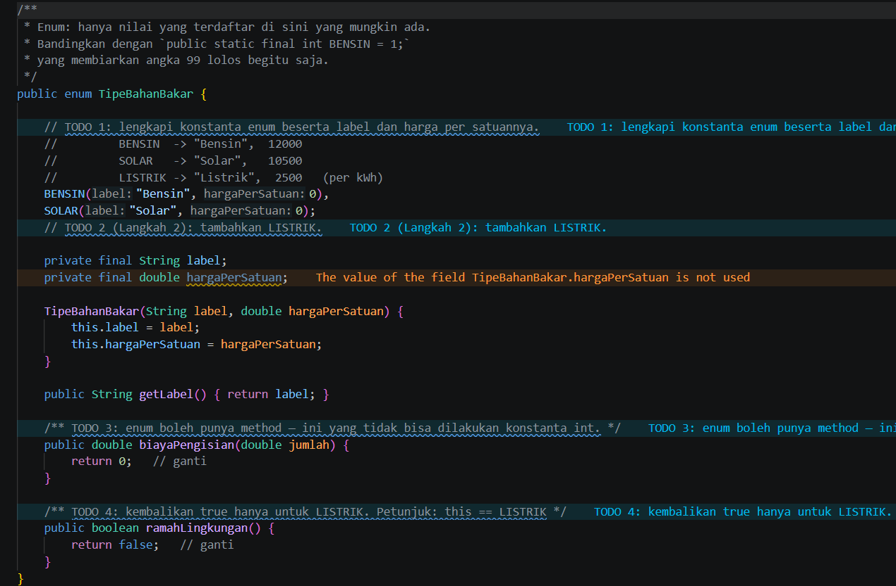
- **After** (kondisi akhir): 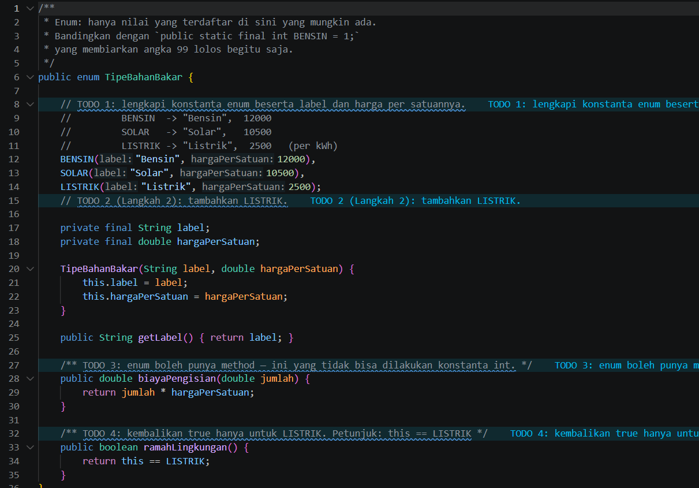

### Output

---

## 2. Implementasi PHP

### 2.1. File: `main.php`

**Penjelasan Kode:**
> Program PHP yang menguji pemanggilan kontrak perilaku dari interface pada objek terkait.

**Bukti Eksekusi (Screenshot):**
- **Before** (kondisi awal/kesalahan, jika ada): 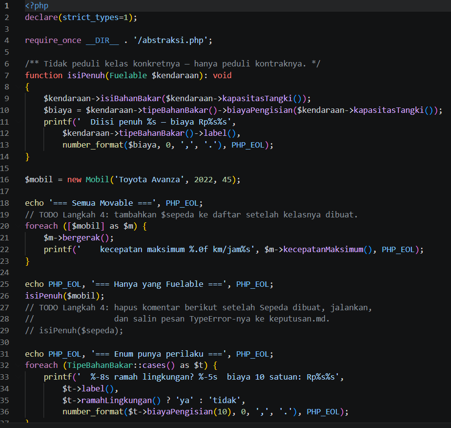
- **After** (kondisi akhir): 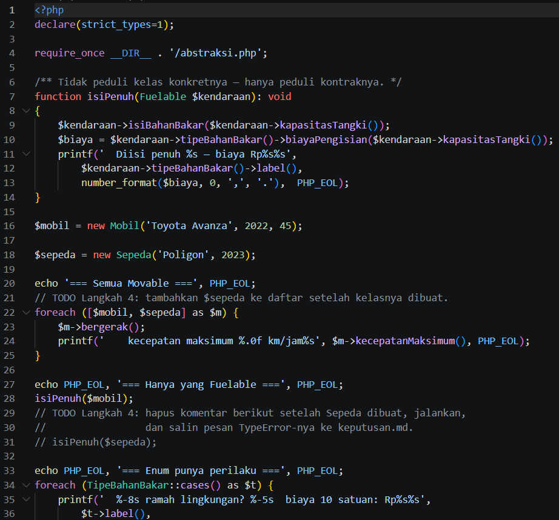

### 2.2. File: `abstraksi.php`

**Penjelasan Kode:**
> Pendefinisian struktur antarmuka dan implementasi kelas ganda dalam PHP.

**Bukti Eksekusi (Screenshot):**
- **Before** (kondisi awal/kesalahan, jika ada): 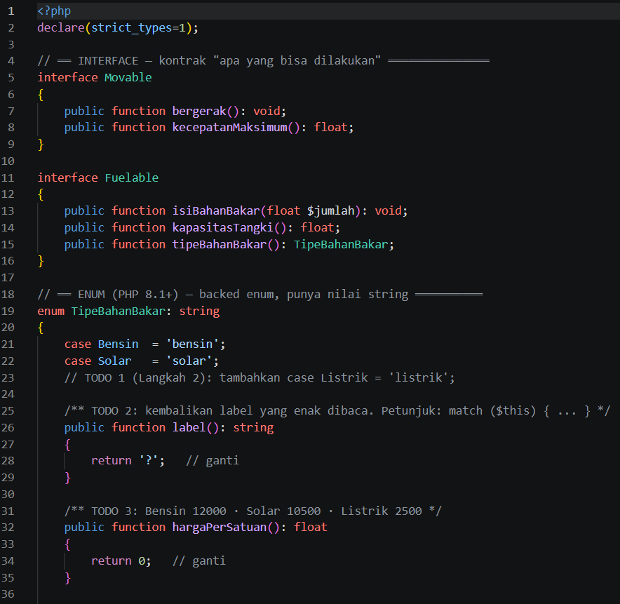
- **After** (kondisi akhir): 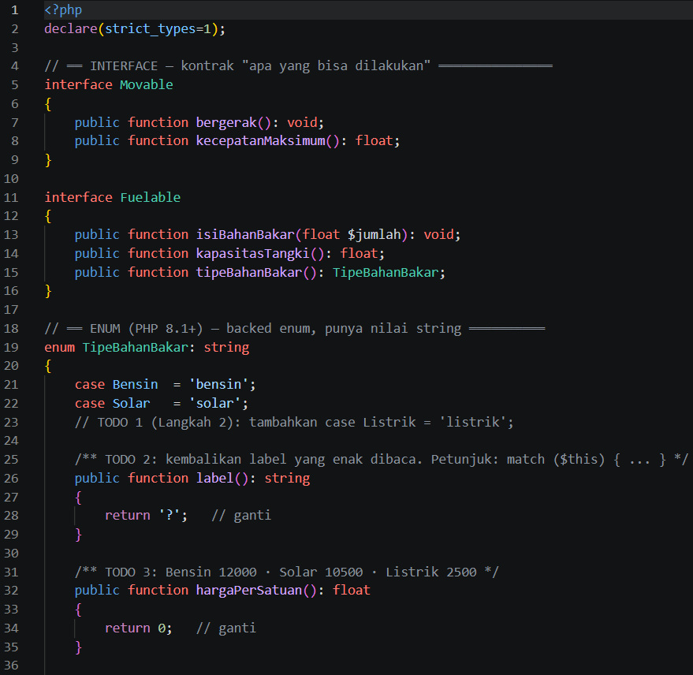

### Output

**Output Program:**

Simpan tangkapan layar hasil eksekusi PHP pada `screenshots/output-php.png`, lalu tampilkan menggunakan Markdown berikut:

---

## 3. Kesimpulan

Astract class berfungsi untuk mewariskan atribut serta fungsi dasar sekaligus mewajibkan kelas anak untuk merealisasikan method abstrak yang ada. Di sisi lain, interface berperan dalam menetapkan kapabilitas wajib suatu objek, sementara enum berfungsi sebagai pembatas agar nilai variabel tetap berada dalam koridor yang valid. Dengan adanya pemisahan kontrak ini, fungsi seperti isiPenuh dapat menjamin bahwa hanya objek yang memiliki fitur pengisian bahan bakar sajalah yang dapat diproses.